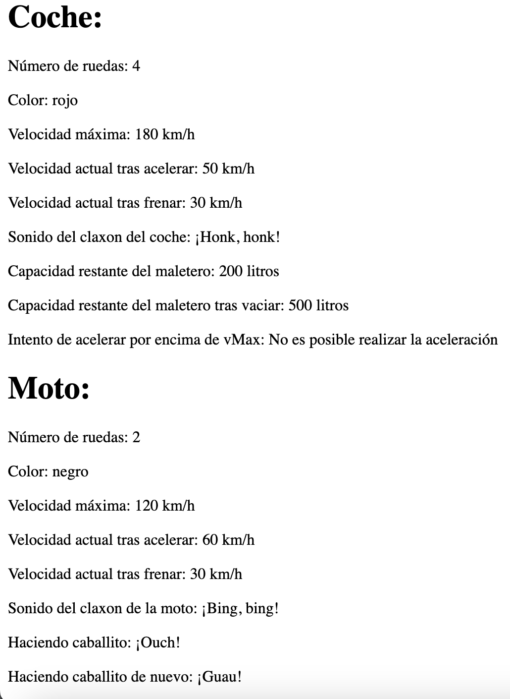

# Ejercicios Tema 2

### [Soluciones](https://github.com/guillermoroman/dwes-t2-ejercicios-con-soluciones)

## Ejercicios sencillos con bucles

### ej-sencillo-1
Suma todos los elementos de un array utilizando la estructura `while(){}`.

### ej-sencillo-2
Concatena todos los elementos de un array utilizando la estructura `do{}while()`.

### ej-sencillo-3
Multiplica todos los elementos de un array utilizando la estructura `for(){}`.

### ej-sencillo-4
Imprime en una lista numerada todos los elementos de un array utilizando la estructura `foreach(){}`.

---

## Ejercicios sencillos con estructuras condicionales

### Ejercicio 1
Escribe un programa en PHP que verifique si un número dado es positivo, negativo o cero, usando condicionales `if`, `else`, y `elseif`.
**Requisitos:**
- Declara una variable con un número.
- Usa una estructura condicional para verificar si el número es positivo, negativo o igual a cero.
- Imprime un mensaje adecuado para cada caso.

### Ejercicio 2
Escribe un programa en PHP que determine si una persona es mayor de edad según su edad.
**Requisitos:**
- Declara una variable con la edad de la persona.
- Si la edad es mayor o igual a 18, imprime "Eres mayor de edad".
- Si la edad es menor a 18, imprime "Eres menor de edad".

### Ejercicio 3
Escribe un programa en PHP que tome tres números y determine cuál es el mayor de ellos.
**Requisitos:**
- Declara tres variables con números diferentes.
- Usa **condicionales** para comparar los tres números.
- Imprime cuál es el mayor.

### Ejercicio 4
Escribe un programa en PHP que realice una operación aritmética (suma, resta, multiplicación o división) entre dos números, dependiendo de un operador dado. Usa la estructura switch para gestionar las diferentes operaciones.
**Requisitos:**
- Declara dos variables con los números que se van a operar.
- Declara una variable con el operador (puede ser +, -, *, /).
- Usa la estructura **switch** para evaluar el operador y realizar la operación correspondiente.
- Imprime el resultado de la operación.
- Si el operador no es válido, imprime un mensaje de error.

### Ejercicio 5
Escribe un programa en PHP que determine si un número es par o impar utilizando el operador ternario.
**Requisitos:**
- Declara una variable con un número entero.
- Usa el **operador ternario** para verificar si el número es divisible entre 2 (par) o no (impar).
- Imprime un mensaje indicando si el número es par o impar.

---

## Ejercicios avanzados con funciones

### Ejercicio 1
Escribe una función que calcule el factorial de un número (positivo), que acepte un número como argumento. No hace falta crear una interfaz para introducir el número; lo podemos introducir manualmente en el código en esta ocasión.

### Ejercicio 2
Escribe una función `esPrimo`para comprobar si un número es primo o no. Ha de devolver un valor booleano.
> [!NOTE]
> Un número es primo si es natural, mayor que 1 y no tiene divisores positivos además de 1 y el mismo número.

### Ejercicio 3
Escribe una función `darVuelta` que de la vuelta a una cadena de texto. Debe devolver una cadena.

### Ejercicio 4
Escribe una función `ordenarArray` que ordene un array de enteros. Se pasa el array por referencia. Se recomienda utilizar el método de la burbuja que consiste en recorrer el array y, en cada pasada, comparar e intercambiar (si procede) elementos del array. 

### Ejercicio 5
Escribe una función `estaEnMinusculas´ que compruebe que un string está completamente en minúsculas. Ha de devolver un valor booleano.

### Ejercicio 6
Escribe una función `esPalindromo` en PHP que comrpueba si una cadena es un palíndromo o no. Ha de devolver un valor booleano.
> [!NOTE]
> Un palíndromo es una palabra, frase o secuencia que se lee igual en las dos direcciones, por ejemplo: `madam`, o `nurses run`.

---

## Ejercicios sobre clases

### Ejercicio 1

Crea una clase madere `Vehiculo` de la cual heredan las clases hijas `Coche` y `Moto`.

#### `Vehiculo`
La clase vehículo deberá tener las **propiedades**:
 -  `numRuedas`
 -  `color`
 -  `posX`, inicializada a 0.
 -  `posY`, inicializada a 0.
 -  `velocidad`, incializada a 0.
 -  `vMax`que almacenará la velocidad máxima.

Deberá tener los métodos:
- `acelerar` que recibe un entero y modifica su velocidad según el entero recibido. La velocidad nunca podrá superar la `vMax`. En caso de que la aceleración pida subir por encima de la `vMax`, se dejará la velocidad con el valor de `vMax`, y se devolverá el mensaje "No es posible realizar la aceleración".
- `frenar` que recibe un entero y modifica su velocidad según el entero recibido.
- `tocarClaxon` que devuelve la cadena _"¡Beep, beep!"_.
- getters y setters para las propiedades.

#### `Coche`
Tendrá los siguientes valores por defecto:
- `numRuedas` = 4

Sumará las propiedades:
- `capacidadTotalMaletero` que expresaremos en litros.
- `capacidadRestanteMaletero` que expresaremos en litros y debería asumir que el maletero está vacío al crear una instancia.
- `numPuertas` que deberá ser un número entero menor o igual a 5.

Sumará los métodos
- `meterEnMaletero` que recibirá como parámetro el volumen en litros de lo que se desea introducir. Si el número de litros a introducir sobrepasa el espacio disponible, imprimirá el mensaje _"No hay espacio suficiente"_.
- `vaciarMaletero` que asignará de nuevo el valor de `capacidadTotalMaletero`a el atributo ´capacidadRestanteMaletero`.

Modificará los métodos:
- `tocarClaxon´ que devuelve la cadena _"¡Honk, honk!"_.

#### `Moto`
Tendrá los siguientes valores por defecto:
- `numRuedas` = 2

Sumará los métodos
- `hacerCaballito` que devolverá de forma aleatoria la cadena _"¡Guau!"_ o la cadena _"¡Ouch!"_.
- 
Modificará los métodos:
- `tocarClaxon` que devuelve la cadena _"¡Bing, bing!"_.


#### `index.php`
Deberá crear tres variables: `$vehiculo`, `$coche` y `$moto`.


Crea un archivo index.php donde instancies objetos de las clases Coche y Moto, y prueba todas las propiedades y métodos definidos en la clase madre Vehiculo y las clases hijas.

**1. Instanciación de objetos:**
- Crea un objeto de la clase Coche con los siguientes valores:
    - `color` = “rojo”
    - `vMax` = 180
    - `capacidadTotalMaletero` = 500 litros
    - `numPuertas` = 4
- Crea un objeto de la clase Moto con los siguientes valores:
    - `color` = “negro”
    - `vMax` = 120
**2. Probar las propiedades:**
- Muestra por pantalla el número de ruedas de cada vehículo utilizando los getters.
- Muestra por pantalla el color y la velocidad máxima de cada vehículo utilizando los getters.
**3. Probar los métodos de Vehiculo:**
- Usa el método acelerar de ambos vehículos para incrementar la velocidad y muestra la velocidad resultante.
- Usa el método frenar para reducir la velocidad y muestra la velocidad resultante.
- Usa el método tocarClaxon de cada vehículo y muestra el sonido que hacen.
**4. Probar los métodos específicos de Coche:**
- Usa el método meterEnMaletero para introducir 300 litros de equipaje en el maletero del coche.
- Muestra por pantalla la capacidad restante del maletero.
- Vacía el maletero usando el método vaciarMaletero y muestra la capacidad restante del maletero.
**5. Probar los métodos específicos de Moto:**
- Usa el método hacerCaballito varias veces y muestra el resultado de cada intento por pantalla.

#### Captura de pantalla de ejemplo


## Ejercicios con filtros

### Ejercicio 1: Filtrar libros por año de lanzamiento
Utilizando como base el código del ejemplo visto en clase, filtra los libros que fueron lanzados antes de 2015. Muestra sólo los libros cuya fecha de lanzamiento es anterior a 2015 en la lista.

Indicaciones:
- Utiliza array_filter para filtrar el array de $books basándote en el valor del año de lanzamiento (releaseYear).
- Muestra el nombre del libro, el año de lanzamiento y el autor en la lista.

### Ejercicio 2: Filtrar libros cuyo nombre contenga una palabra específica
Modifica el código para filtrar los libros cuyo nombre contiene una palabra específica proporcionada por el usuario, por ejemplo, “The”. Muestra los libros cuyo nombre contenga esa palabra en la lista.

Indicaciones:
- Usa `array_filter` y strpos para verificar si la palabra está presente en el campo name de cada libro.
- Usa una variable con el valor de la palabra a buscar (por ejemplo, $searchTerm = 'The';) y permite que esta palabra se pueda modificar fácilmente.
- Asegúrate de que la búsqueda no sea sensible a mayúsculas y minúsculas.

Pistas:
- Usa la función `stripos` en lugar de `strpos` para que la búsqueda no sea sensible a mayúsculas.

¡Claro! Aquí tienes dos nuevos ejercicios que ilustran filtros diferentes utilizando iteración sobre arrays en PHP, pero esta vez vamos a trabajar con otro tipo de array para hacerlo más interesante.

### Ejercicio 3: Filtrar productos según el precio y aplicar descuento

Vamos a trabajar con un array de productos. Cada producto tiene un nombre, un precio y una categoría. El ejercicio consiste en filtrar los productos que cuestan más de 50 unidades monetarias y, además, aplicarles un 20% de descuento. Muestra los productos filtrados con su nuevo precio.

Array de ejemplo:
```php
$products = [
    [
        'name' => 'Laptop',
        'price' => 1000,
        'category' => 'Electronics'
    ],
    [
        'name' => 'T-shirt',
        'price' => 20,
        'category' => 'Clothing'
    ],
    [
        'name' => 'Smartphone',
        'price' => 800,
        'category' => 'Electronics'
    ],
    [
        'name' => 'Coffee Maker',
        'price' => 45,
        'category' => 'Home Appliances'
    ]
];
```
Instrucciones:

	1.	Usa `array_filter` para seleccionar los productos cuyo precio sea superior a 50.
	2.	Usa `array_map` para aplicar un descuento del 20% a esos productos.
	3.	Muestra el nombre del producto, su precio original y el precio con descuento.

### Ejercicio 4: Filtrar empleados por antigüedad y departamento

Ahora vamos a trabajar con un array de empleados. Cada empleado tiene un nombre, un departamento y los años que ha trabajado en la empresa. El ejercicio consiste en filtrar aquellos empleados que llevan más de 5 años en el departamento de “Ventas” y mostrarlos en una lista.

Array de ejemplo:
```php
$employees = [
    [
        'name' => 'John Doe',
        'department' => 'Sales',
        'years' => 6
    ],
    [
        'name' => 'Jane Smith',
        'department' => 'HR',
        'years' => 4
    ],
    [
        'name' => 'Sam Johnson',
        'department' => 'Sales',
        'years' => 3
    ],
    [
        'name' => 'Emily Davis',
        'department' => 'Sales',
        'years' => 8
    ]
];
```

Instrucciones:
1. Usa `array_filter` para seleccionar empleados que trabajen en el departamento de “Ventas” y que lleven más de 5 años.
2. Muestra el nombre del empleado y cuántos años lleva trabajando.
